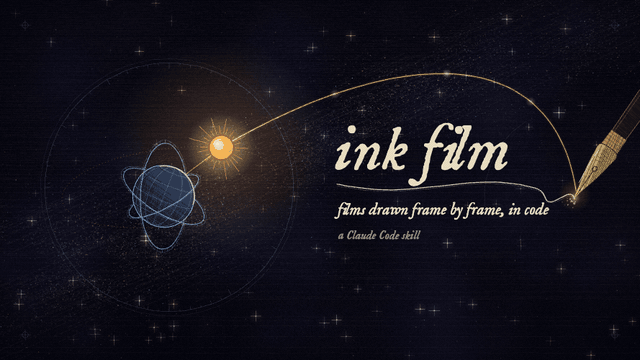
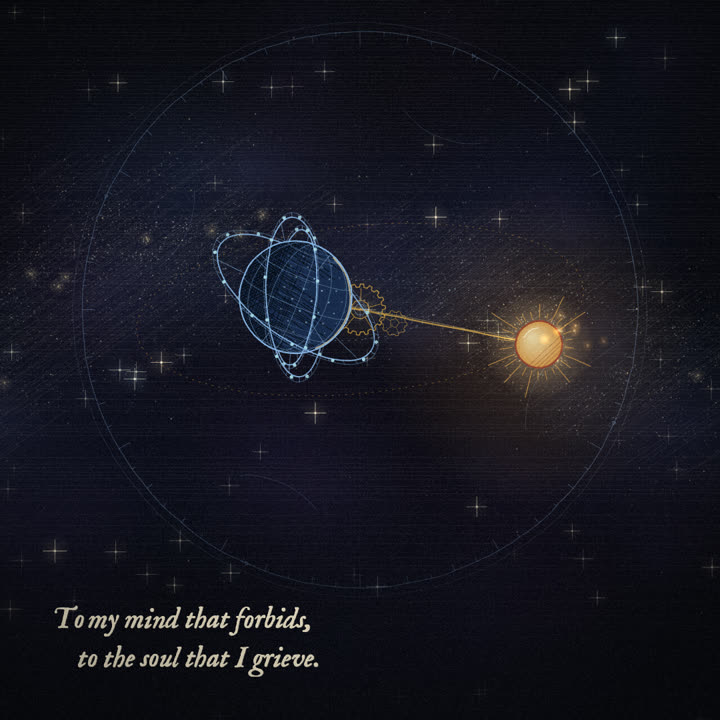
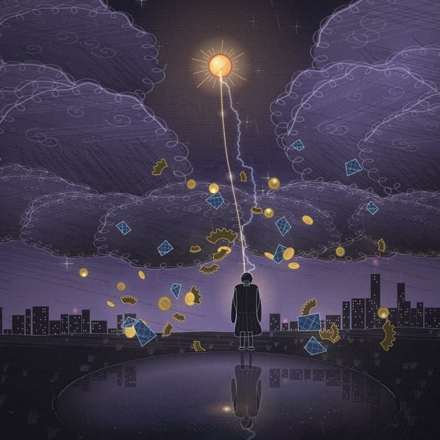
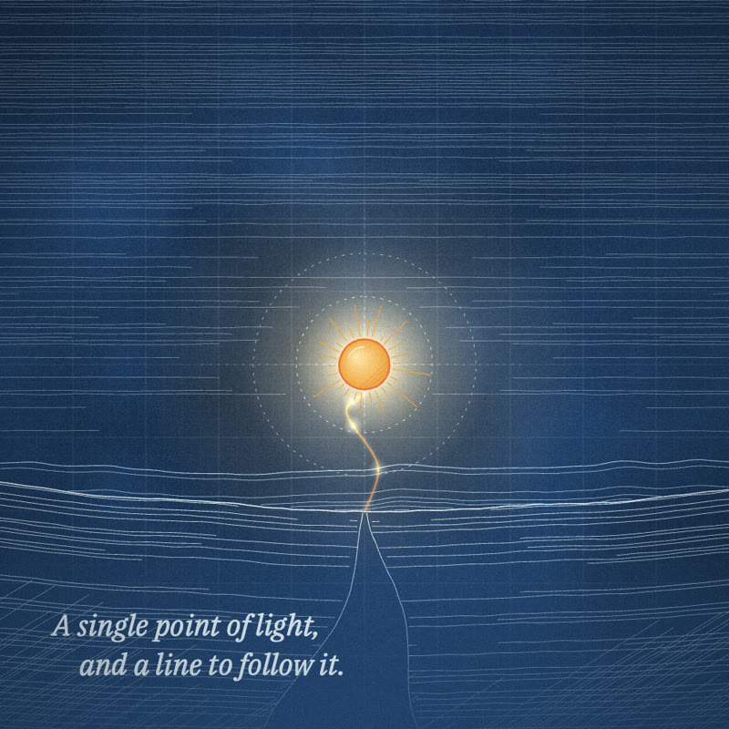
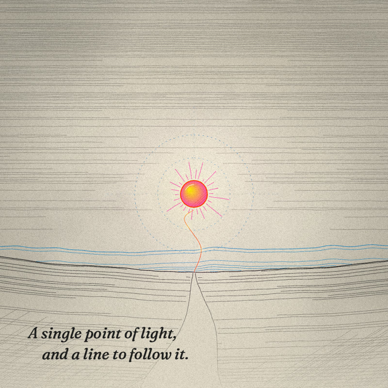

<p align="center">
  
</p>

# ink film

**Hand-drawn films, drawn in code.** A [Claude Code](https://claude.com/claude-code) skill that turns a poem, a script or a brand story into a short animated film in which **every frame is drawn in JavaScript** on a canvas: ink lines that wobble and re-draw themselves twelve times a second, tone built from engraved hatching, paper and cosmos textures, and lines of text that write themselves on. It then ships the film as a web page and exports MP4, a silent MP4, a WAV soundtrack and SRT captions.

<p align="center">
  
  
</p>

The first film made this way is **To My Mind That Forbids** — a 90-second, nine-plate reading of a poem by Sahaib Singh Arora, told from the cosmos. Its full source is in [`examples/to-my-mind/`](examples/to-my-mind/).

## Install

```bash
git clone https://github.com/sahaib/ink-film ~/.claude/skills/ink-film
```

You also need **Google Chrome**, **Node.js 20+** and **ffmpeg** (for video export). Each new film installs its own copy of the render tools (`playwright-core`, which drives your Chrome).

## Make a film

In Claude Code, type **`/ink-film`** — or just ask:

> make an ink film of this poem: …
> turn our launch script into a 30-second risograph film for Reels

Claude follows the skill's seven stages, stopping for your approval at each gate:

| # | Stage | You approve |
|---|---|---|
| 1 | **Brief** — purpose, source text (verbatim), length, aspect, look, rules, sound | the brief |
| 2 | **Reading & storyboard** — what the text means, then one plate per movement | the storyboard |
| 3 | **Style frame** — one plate built to finished quality | the look |
| 4 | **Build** — parallel agents draw the plates, each rendering and checking its own frames | — |
| 5 | **Verify** — every quarter-second rendered for errors, contact sheets, seams, frame rate, layout | — |
| 6 | **Deliver** — web page + MP4 / silent MP4 / WAV / poster / SRT | — |
| 7 | **Log** — what was learned goes into [`learnings.md`](learnings.md), so the next film starts smarter | — |

Fill in [`brief.md`](brief.md) up front if you like — the better the brief, the better the first storyboard.

Or drive it by hand:

```bash
~/.claude/skills/ink-film/scripts/new-film.sh my-film 9:16 risograph "My Film"
cd my-film
./build.sh dist/film.html --wrap        # open it in Chrome
node tools/video.mjs dist/film.html out/  # → MP4 (master + share), silent MP4, WAV, poster, SRT
```

## Looks

| Engraved Cosmos | Blueprint | Risograph | Brand-mapped |
|---|---|---|---|
|  |  |  |  |
| iron-gall ink on aged paper, and the cosmos | cyanotype, construction lines, one warm accent | fluorescent inks, loose register, halftone | a company's own colours and fonts |

Every look works in **1:1** (1080×1080), **9:16** (1080×1920, captions kept clear of Reels/Shorts UI) and **16:9** (1920×1080). See [`presets/`](presets/) and the full visual language in [`style-bible.md`](style-bible.md).

## What's inside

```
SKILL.md          the workflow Claude follows
brief.md          the creative brief (your prompt)
style-bible.md    line, hatching, texture, palette roles, type, motion, transitions, budgets
presets/          four looks, with style frames
starter/          the engine: config, kit, presets, engine, audio, example plates, tools
scripts/          new-film.sh — scaffold a film
examples/         To My Mind That Forbids, complete
tests/            the skill's own test suite — tests/run.sh
learnings.md      pitfalls and fixes, appended after every film
films.md          every film made, and the choices behind it
```

The engine is dependency-free JavaScript on Canvas 2D: a seeded ink kit (so every frame is a pure function of time, scrubbable and exportable frame-exact), a timeline of plates with transitions (cut, fade, dark, flare, iris), generated sound (WebAudio, rendered offline for export), adaptive resolution, and a reduced-motion mode.

## Credits

- Inspired by Kevin Ngo's *[life of a fruit fly](https://x.com/kevin_t_ngo/status/2099858454043349342)* — "Claude Opus 5 drew every frame of this animation using JavaScript."
- Built with Claude Code by Sahaib Singh Arora. The poem *To My Mind That Forbids* is his, all rights reserved; the film's code is MIT like the rest.

## License

Code: [MIT](LICENSE). The poem *To My Mind That Forbids* — its words wherever they appear in this repository, including images and documents that quote it — is © Sahaib Singh Arora, all rights reserved. See [NOTICE](NOTICE).
