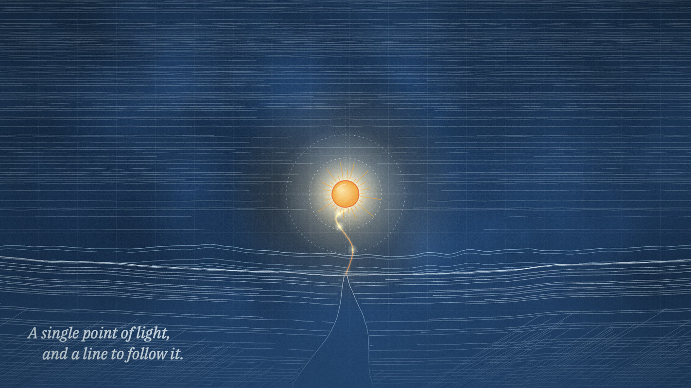

# Preset · Blueprint

*Cyanotype paper, pale construction ink, measured and exact — with one warm accent that doesn't belong to the system.*

**Use for:** product and engineering stories, process explainers, architecture, "how it works", internal strategy films.
**Avoid for:** intimate personal pieces (too cold), food/consumer warmth.

| Role | Hex | Notes |
|---|---|---|
| paper | rag sheet `#F1ECE0` washed `#1E4C8E` (multiply 0.95) | grain, fibres and a faint 25/100-unit grid show through |
| ink / voidInk | `#DCEBF7` | chalk-white primary line |
| mind / sepia | `#9CC7E6` | construction, grids, secondary line |
| cyan | `#BFE3F7` | highlights |
| mindDeep | `#0F2A55` | filled bodies on the sheet |
| void / blueprint | `#0B1A36` | deep navy for night/space plates |
| soul / soulHot | `#F3A53A` / `#FFE6A8` | the one warm thing — the human, the idea, the customer |
| ember | `#E7743F` | warning, heat |
| gold / goldLight | `#E3BE72` / `#F4DDA6` | brass, value |
| ash | `#7C92B0` | spent, drained |
| storm / stormLight | `#1A2B4F` / `#8FA6C8` | weather, night tones |

- **Textures:** cyanotype wash over a rag sheet (stains, fibres, specks, edge darkening), a faint grid every 25 units with a major line every 100; navy void with blue clouds.
- **Type:** IBM Plex Serif italic for lines; IBM Plex Mono for display and UI.
- **Print:** misregistration 0.9, grain 0.45, vignette 0.36.
- **Line:** tighter wobble (amp 0.3–0.6), more construction: dimension lines with arrowheads, compass arcs, section hatching at 45°.
- **Signature moves:** things *draw themselves* as technical drawings, then come alive; exploded views; the accent colour marks the single human element.
- **Text rule:** a dimension line has a small ring where the number would be — unless the brief explicitly wants figures.
