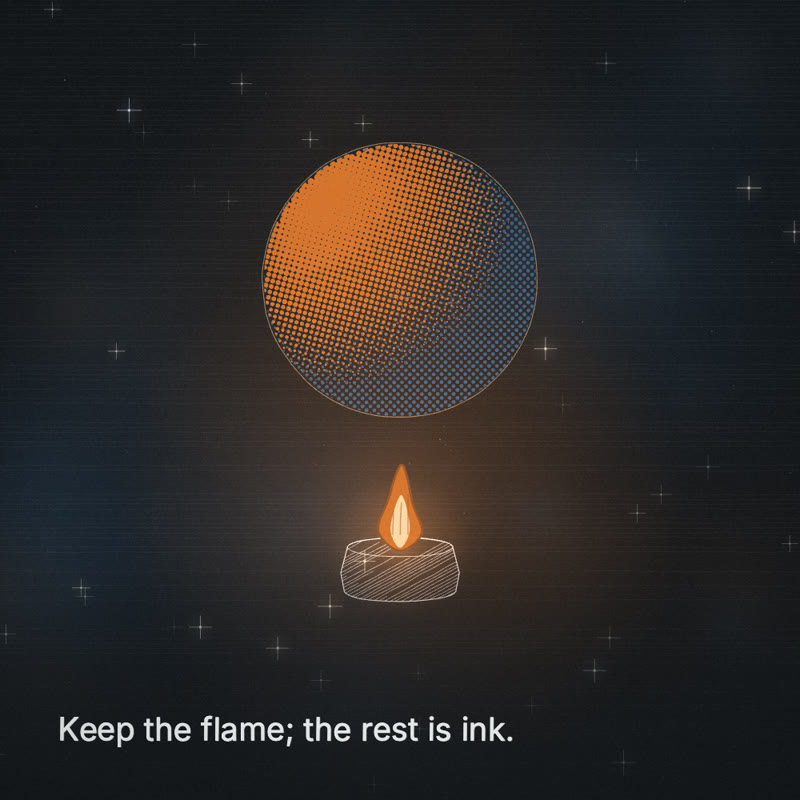

# Preset · Brand-mapped

*The engraved discipline, re-inked in a company's own colours and fonts.* For client and corporate work.




## Collect from the client
- Colours (hex) for: `paper` (light ground) · `ink` (line on paper) · `accent` · `accentHot` · `cool` · `coolDeep` · `dark` (dark ground) · `darkInk` (line on dark)
- Fonts: `fontText` (the script lines on screen, and the page UI) · `fontDisplay` (the colophon line under the film). Google Fonts, or licensed font files they can give you (embed as data URIs).
- Logo (SVG/PNG they own) — end card only unless agreed otherwise.
- Claims and numbers that need sign-off; approvers; platform, aspect, length.

## Map
```js
// film.config.js
preset: 'brand',
brand: {
  paper: '#F5F2EA', ink: '#1C2430', accent: '#E4572E', accentHot: '#FFB199',
  cool: '#3A7CA5', coolDeep: '#16324F', dark: '#0E1621', darkInk: '#E8ECF1',
  fontDisplay: 'Fraunces', fontText: 'IBM Plex Sans',   // lines lettered in IBM Plex Sans; Fraunces sets the colophon
},
```
`K.brand(tokens)` maps these onto the roles (`accent → soul`, `accentHot → soulHot`, `cool → mind`, `coolDeep → mindDeep` and `blueprint`, `dark → void`, `darkInk → voidInk`) and mixes the rest (`sepia`, `cyan`, `ember`, `ash`, `gold`, `goldLight`, `storm`, `stormLight`). Leave out a token and the current look's value is kept; leave out `accentHot` and it is mixed from `accent`. The fonts are the exception: leave out one of `fontDisplay` / `fontText` and it takes the other's family (with only `fontFiles`, their first family sets both); leave out both and the current look's fonts stay. It works on top of any preset — on `brand` it also rebuilds the clean-paper texture and the page colours from the tokens.

Defaults before any tokens: paper `#F6F4EF` · ink `#1E2228` · accent `#E0782E` · accentHot `#FFD9A6` · cool `#3F6E9E` · coolDeep `#1B2E47` · dark `#14171C` · darkInk `#EEF0F2` · Inter. Print: misregistration 0.6, grain 0.25, vignette 0.16.

## Rules
- **Contrast:** `K.brand` warns in the console when `ink` on `paper` or `darkInk` on `dark` is below 4.5:1, and letters captions in the first role that reaches 4.5:1 (or pushes the best one toward black/white until it does). Fix the palette with the client rather than shipping the warning.
- **Fonts:** brand faces are requested as plain Google Fonts families at weight 400, so Google-hosted brand captions are **upright** (italics are not requested, because Google rejects italic requests for families that lack them). Family names must be plain letters/digits/spaces.
- **Client-licensed font files:** embed them — never link them — with `fontFiles`:
  ```js
  brand: { …, fontDisplay: 'Acme Serif', fontText: 'Acme Sans',
           fontFiles: [{ family: 'Acme Serif', src: 'data:font/woff2;base64,…', style: 'italic', weight: 400 },
                       { family: 'Acme Sans',  src: 'data:font/woff2;base64,…' }] },
  ```
  Each is loaded with the FontFace API before the first frame; anything that is not a `data:` URI is refused with a console warning, and embedded families are never requested from Google. An italic file for the text or display family turns captions italic (captions are lettered in `fontText`). Base64 contains `/`, so edit that config line with a script or by hand, not `sed s///`.
- **One accent.** Brands often have five colours; the film uses one warm accent against a cool system. Put the rest in the end card.
- **The logo is not a motif.** Find an anchor motif that belongs to the story (a spark, a thread, a door) and let the logo appear once, at the end.
- **Only what they own.** Never use another company's marks, product UI or trade dress; no real people's likenesses without consent.
- **Text on screen** is still the script lines only, plus an end card if the brief asks for one.
