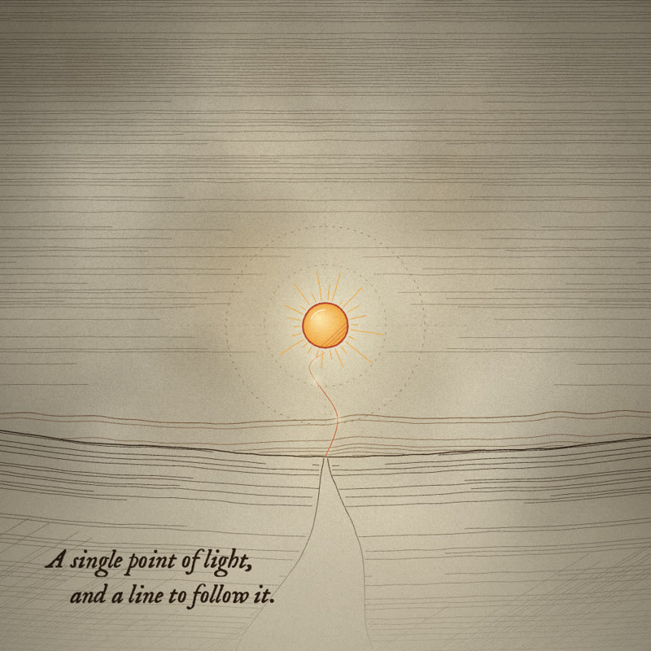
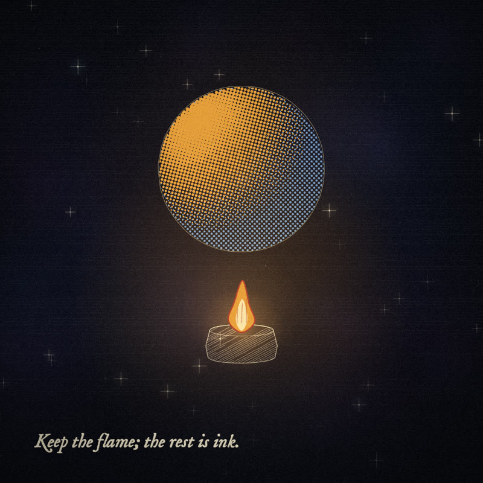

# Preset · Engraved Cosmos

*Iron-gall ink on aged plate paper, and the cosmos as black velvet with ruled skies.* The look of the reference film.

**Use for:** personal and poetic films, origin stories, anything about the self, time, faith, memory, the universe.
**Avoid for:** dense product information; bright, upbeat launches.

| Role | Hex | | Role | Hex |
|---|---|---|---|---|
| void | `#07070F` | | voidInk | `#E8DDC2` |
| paper | `#EDE0C4` | | ink | `#2B1A10` |
| soul | `#F3A53A` | | soulHot | `#FFE6A8` |
| mind | `#86B3E3` | | mindDeep | `#16284A` |
| cyan | `#A9DDEA` | | ember | `#B8412C` |
| gold | `#C99A3E` | | goldLight | `#EACB7A` |
| ash | `#6E6862` | | sepia | `#6B4A2E` |
| blueprint | `#13274B` | | storm / stormLight | `#2B2440` / `#8E86AA` |

- **Textures:** aged paper (fibres, specks, blotches, edge burn) · void (navy/plum blotches) · film grain · vignette · ruled skies.
- **Type:** IM Fell English italic for lines; IM Fell English SC + IBM Plex Mono for the page UI.
- **Print:** misregistration 1.4, grain 0.5, vignette 0.42.
- **Line:** outlines 1.3–2.2, boil 12 fps.
- **Signature moves:** engraved hatching with density, star fields with 4-point sparkles, soul-star glow, orreries and armillary rings, a sepia locket for memories, cyanotype blueprint for "the world's rules".
