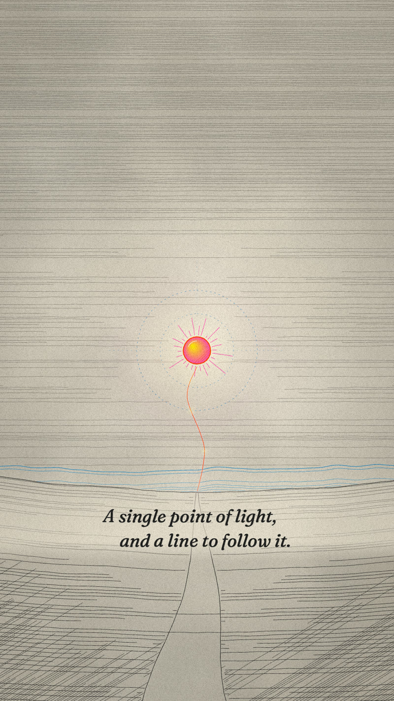
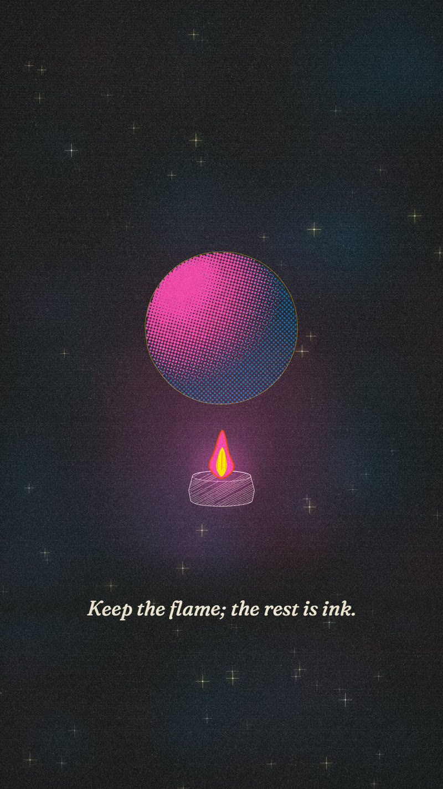

# Preset · Risograph

*Two or three fluorescent-bright inks printed slightly out of register on warm stock — grainy, joyful, editorial.*

**Use for:** brand stories, culture and team films, launches, event teasers, anything that should feel human and a little handmade.
**Avoid for:** solemn subjects; strict brand palettes that aren't riso-like (use Brand-mapped instead).

| Role | Hex | Riso ink |
|---|---|---|
| paper / voidInk | `#F3EAD7` | cream stock |
| ink / void | `#1A1A1A` | Black |
| soul | `#FF48B0` | Fluorescent Pink |
| soulHot / goldLight | `#FFE800` | Yellow |
| mind / sepia / blueprint | `#0078BF` | Medium Blue |
| mindDeep / storm | `#002284` | (deep blue overprint) |
| ember | `#FF4100` | (pink × yellow overprint, red-orange) |
| gold | `#FFA500` | (warm overprint) |
| cyan / stormLight | `#7AB1CB` | (tint) |
| ash | `#918C82` | (grey, spent) |

- **Tone device:** halftone dots (`K.halftone`) instead of engraved hatching; overprint where two inks meet (multiply).
- **Print:** misregistration 3.5 units (`K.MIS`), heavy grain (0.9), light vignette (0.12); the void gets 5,000 cream specks like a dark riso sheet.
- **Type:** Fraunces italic for lines; IBM Plex Mono for UI.
- **Line:** thicker (1.8–3), fewer lines, bolder shapes; boil still 12 fps.
- **Signature moves:** layers that slide into register at the key moment; big flat shapes with halftone shading; limited palette discipline — never more than three inks plus black.
